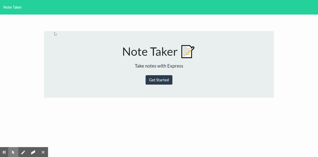

# Note-Taker

  

For users that need to keep track of a lot of information, it's easy to forget or be unable to recall something important. Being able to take persistent notes allows users to have written information available when needed.

This Node CLI application will enable users to write, save, and dete notes. This application will use an express backend and save and retrieve note data from a JSON file.

## Table of Contents
[Deployed Application](https://github.com/Rogers-Development-Services/Template-Engine---Empolyee-Summary#deployed-application)

[Installation](https://github.com/Rogers-Development-Services/Template-Engine---Empolyee-Summary#installation)

[Usage](https://github.com/Rogers-Development-Services/Template-Engine---Empolyee-Summary#usage)

[Screenshots](https://github.com/Rogers-Development-Services/Template-Engine---Empolyee-Summary#screenshots)

[Videos](https://github.com/Rogers-Development-Services/Template-Engine---Empolyee-Summary#videos)

[Testing](https://github.com/Rogers-Development-Services/Template-Engine---Empolyee-Summary#testing)

[Future Updates](https://github.com/Rogers-Development-Services/Template-Engine---Empolyee-Summary#future-updates)

[Questions](https://github.com/Rogers-Development-Services/Template-Engine---Empolyee-Summary#questions)

[Credits](https://github.com/Rogers-Development-Services/Template-Engine---Empolyee-Summary#credits)

[License](https://github.com/Rogers-Development-Services/Template-Engine---Empolyee-Summary#license)

## Deployed Application

Here is an example of our app in action: 



## Installation

Download this package, open your command line interface and run npm install. This should install the following dependencies aswell: express, path, and moment. If for some reason, you need to install the dependencies individually run npm install "dependency_name".

Next run the following command to start the app: "node index.js"

```bash
npm install 
```

```bash
npm install express
```

## Usage 

The application will deploy a note taking application in a web browser sent from a heroku server. Begin by clicking the "Get Started" button. This will take you to the note taking page. 

### To compose a new note:
You should be able to begin compossing a note by clicking on the pencil icon in the upper right hand corner of your display. Next click on the words "Note Title" in the top center of your viewport and you should see a cursor appear and begin blinking (this means its ready to type). Once you've decied on your note title type it in and click on the words "Note Text" and similarly type out whatever description you'd like for your note. Once you are finished click the save (floppydisk) icon in the upper right hand corner to save. (You should see your new note appear in the left hand column with its title displayed. Lastly, to update any of your saved notes simply click on the note as it appears in the left hand column, edit the contents, and click on the save icon again.

### To delete a note:
If you no longer have need of one of your composed notes simply select the note from the left hand column, by clicking the red trash can icon.

Note: When you delete a note, you will not be able to recover your data.

### Screenshots


### Videos

[](https://www.youtube.com/watch?v=zvnbJlmm2jU)


## Testing

Testing Instructions: Currently, there are no written tests for this application, but if you wish to write your, change the scripts property in package json file.

```bash
npm install jest
```

```bash
npm test
```

## Future Updates
This application is a work in progress, future updates will include: 
1. Additional Styling for templates.
2. Providing links to relate notes to one another.

## Questions

Share with us with any comments or questions to help us grow! 

GitHub Profile: [Rogers-Development-Services](https://www.github.com/Rogers-Development-Services)

Email: [matthew.shane.rogers@gmail.com](matthew.shane.rogers@gmail.com)

## Credits

Code template provided by Trilogy Education 

Thanks to [Nick Konzen](https://github.com/NTKonzen), [Tim Sanders](https://github.com/tbsanders5), [Aaron Platt](https://github.com/aaronkplatt)A for troubleshooting and debugging assistance.

Grateful for [Matt Milici](https://github.com/mattmilici/personal-site) for assistance in programming DELETE function.

Thankful for [Dan Shahin](https://www.youtube.com/watch?v=nvPOUdz5PL4) for providing a workaround for uploading images to github for your README.md. 

## Licenses
Licensed under the GNU General Public License v3.0,MIT License lincense(s).